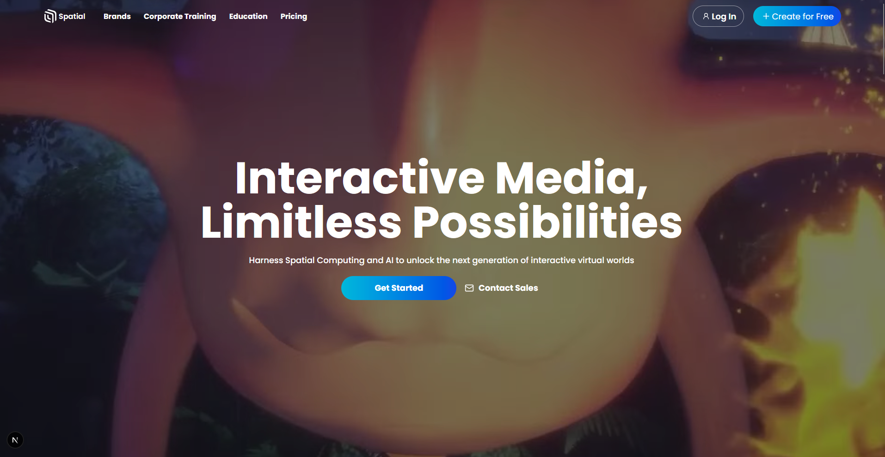

# ✨ Spatial.io Clone

A dynamic and animated recreation of the Spatial.io hero section, built with Next.js and Tailwind CSS. This project focuses on replicating the fluid user interface and engaging animations of the original website.

### 🔗 **Live Demo:** [**spatial-psi.vercel.app**](https://spatial-psi.vercel.app/)



---
## 🚀 Key Features

This clone meticulously implements the core features of the Spatial hero page:

-   **Smooth Scrolling Animations:** Elements animate into view as you scroll down the page, creating a dynamic user experience.
-   **Infinite Marquee Scroller:** A seamless, looping scroller for showcasing logos and use cases, which pauses on hover.
-   **Responsive Design:** Fully responsive layout that looks great on desktops, tablets, and mobile devices.
-   **Interactive UI:** Hover effects and interactive elements that mimic the original site's behavior.

---
## 🛠️ Tech Stack

This project was built using a modern frontend stack:

-   **Framework:** [Next.js](https://nextjs.org/) (React)
-   **Styling:** [Tailwind CSS](https://tailwindcss.com/)
-   **Deployment:** [Vercel](https://vercel.com/)

---
## 🚀 Getting Started

To run this project locally, follow these steps:

1.  **Clone the repository:**
    ```bash
    git clone [https://github.com/your-username/your-repo-name.git](https://github.com/your-username/your-repo-name.git)
    ```
2.  **Navigate to the project directory:**
    ```bash
    cd your-repo-name
    ```
3.  **Install dependencies:**
    ```bash
    npm install
    ```
4.  **Run the development server:**
    ```bash
    npm run dev
    ```

Open [http://localhost:3000](http://localhost:3000) in your browser to see the result.